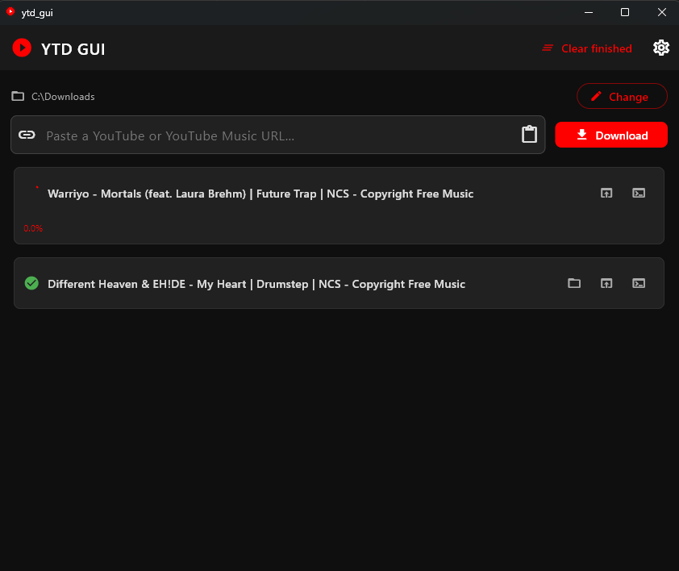

# YTD GUI

A clean, dark-themed Windows desktop app for downloading YouTube and YouTube Music audio as high-quality M4A files. Built with Flutter on top of [yt-dlp](https://github.com/yt-dlp/yt-dlp).

> 🤖 **Vibe-coded by [Claude](https://claude.ai)** — designed, architected, and written entirely through an AI-assisted session with no manual code editing.

---

## Features

- **Paste & download** — paste any YouTube or YouTube Music URL and hit Download
- **Always M4A, always highest bitrate** — audio is extracted and remuxed at the best available quality
- **Playlist support** — paste a playlist URL and every track downloads individually, each with its own progress bar
- **Real video/song titles** — the list shows the actual title fetched from YouTube, not a URL code
- **Per-track status** — queued, downloading (with % progress), converting, done ✓, or failed ✗
- **Retry individual failures** — re-run just the tracks that failed without restarting the whole queue
- **3-strike safety stop** — if three tracks fail in a row, the queue pauses automatically so you know something is wrong
- **Open in browser** — jump straight to the YouTube page for any item in your list
- **Show in folder** — opens Windows Explorer with the downloaded file selected
- **Detailed log viewer** — view raw yt-dlp output per track to diagnose errors; copy to clipboard in one click
- **Loudness normalization** — optional LUFS-based normalization (two-pass, linear gain) so every track plays back at a consistent perceived volume; target defaults to -14 LUFS (Spotify/YouTube standard) and is configurable in Settings
- **Persistent download folder** — remembers your chosen folder between sessions; defaults to your Downloads folder
- **ffmpeg path configuration** — set a custom path to `ffmpeg.exe` in Settings, or leave it blank to use whatever is on your PATH; no auto-download required
- **yt-dlp update notifications** — checks for a newer yt-dlp release on startup and offers to update in one click

---

## Screenshots



---

## Getting Started

### Option A — Run the pre-built executable

1. Download the latest release ZIP from the [Releases](../../releases) page
2. Extract the folder anywhere you like
3. Run `ytd_gui.exe`
4. On first launch the app will automatically download `yt-dlp.exe` if it isn't present
5. Make sure [ffmpeg](https://ffmpeg.org/download.html) is installed and on your PATH, or set a custom path in **Settings → Dependencies**

That's it. No Python required.

### Option B — Build from source

**Prerequisites**
- [Flutter SDK](https://docs.flutter.dev/get-started/install/windows) (stable channel, 3.x or later)
- Visual Studio 2022 with the **Desktop development with C++** workload

```bash
git clone https://github.com/PhilBax/ytd-gui.git
cd ytd-gui
flutter pub get
flutter build windows --release
```

The compiled app will be at:
```
build\windows\x64\runner\Release\ytd_gui.exe
```

Copy the entire `Release\` folder to wherever you want to run it from.

---

## How It Works

```
YTD GUI
│
├── Paste URL
│   ├── Single video → fetches title, queues 1 item
│   └── Playlist URL → expands all tracks, fetches all titles, queues each one
│
├── Per-track download
│   ├── yt-dlp downloads the best audio stream in its native format
│   ├── ffmpeg converts to M4A (256k AAC)
│   ├── [optional] Pass 1 — measure integrated loudness (LUFS)
│   ├── [optional] Pass 2 — re-encode with linear gain applied to hit target LUFS
│   └── File is named after the video title automatically
│
└── Dependencies
    ├── yt-dlp.exe  — auto-downloaded from GitHub on first run
    └── ffmpeg      — use system install (PATH) or set a custom path in Settings
```

---

## Distributing to Another PC

Copy the entire `Release\` folder (not just the `.exe`). It contains the Flutter runtime DLLs the app needs. On first launch on the new machine it will download yt-dlp automatically. ffmpeg must be installed separately or configured via Settings.

---

## Tech Stack

| Layer | Technology |
|---|---|
| UI framework | [Flutter](https://flutter.dev) (Windows desktop) |
| State management | [Riverpod](https://riverpod.dev) |
| Downloader | [yt-dlp](https://github.com/yt-dlp/yt-dlp) |
| Audio conversion | [ffmpeg](https://ffmpeg.org) |
| Preferences | shared_preferences |
| Folder picker | file_picker |
| ZIP extraction | archive |

---

## Known Limitations

- Windows only (no Mac or Linux build at this time)
- Age-restricted or membership-only videos may fail depending on your yt-dlp cookies setup
- Very long playlists (500+ items) may take a moment to resolve titles before the queue appears

---

## License

MIT — do whatever you want with it.

---

*Built with ❤️ and a lot of AI tokens.*
